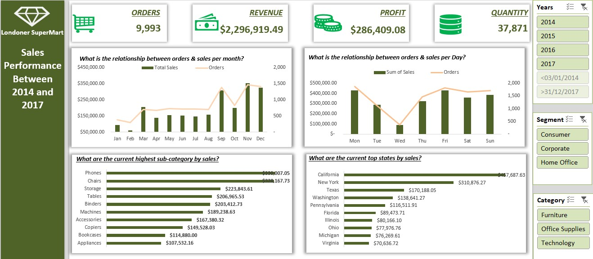
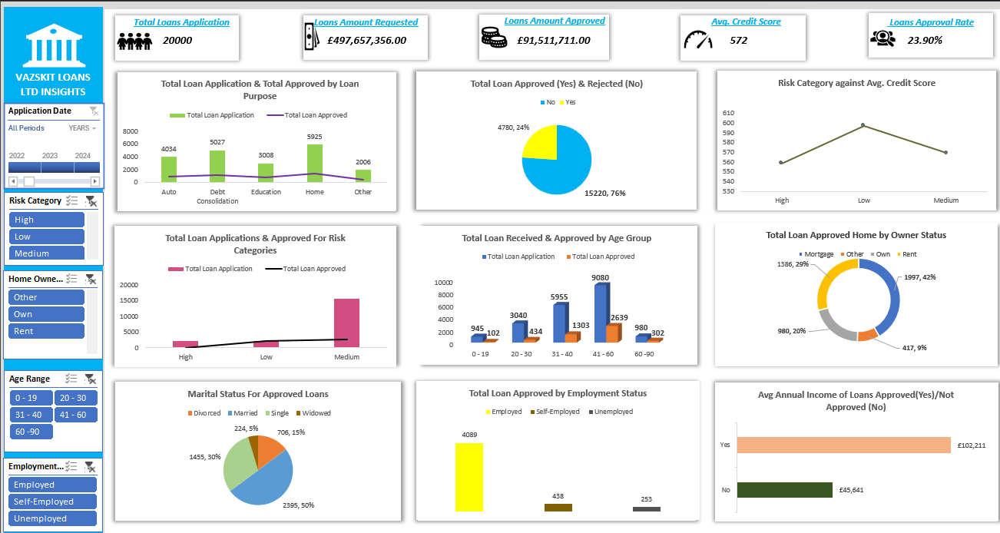

# Project 1

**Title:** [Londoner SuperMart Sales Analysis](https://github.com/AkinolaArilewola/akinolamccarthy.github.io/blob/main/SuperStoreData-210211-161158.xlsx) 

**Tools Used:**
- Microsoft Excel: Data cleaning, transformation, and dashboard creation
- Pivot Tables & Charts: For dynamic aggregation and visualization
- Slicers, Timelines & Filters: For interactive data exploration
- Conditional Formatting: To highlight key metrics and trends

**Project Description:** This project presents a comprehensive sales analysis for Londoner SuperMart, leveraging Excel to transform raw transactional data into actionable insights. The dataset includes over 9,000 orders spanning multiple years, customer segments, product categories, and geographic regions. The dashboard enables stakeholders to monitor performance, identify trends, and make data-driven decisions.

**Key findings:**
- Total Orders: 9,993
- Total Revenue: $2,296,919.49
- Total Profit: $286,409.08
- Total Quantity Sold: 37,871
  
  **Monthly Trends**
- Sales and orders peak in November and December, indicating strong holiday season performance.
- A steady growth pattern is observed from Q1 to Q4 across most years.

  **Weekly Trends**
- Fridays and Mondays show the highest sales volumes, suggesting strategic promotional opportunities.
- Sundays consistently record the lowest activity.

  **Top Performing Sub-Categories**
- Phones
- Chairs
- Storage

   **Top States by Sales**
- California
- New York
- Washington

**Dashboard Overview:**

The Excel dashboard is designed with user-friendly navigation and interactive filters:
- Top Summary Cards: Display total orders, revenue, profit, and quantity
- Monthly & Daily Analysis: Dual-axis charts showing the relationship between orders and sales
- Sub-Category & State Tables: Highlight top contributors to revenue
- Slicers: Allow filtering by year, segment, and category for deeper insight

# Project 2

**Title:** 
[Loan Application, Approval and Risk Insights (2019–2024)](https://github.com/AkinolaArilewola/akinolamccarthy.github.io/blob/main/Loan.xlsx)

**Tools Used:**

•	Microsoft Excel — Data Cleaning, Analysis, and Visualization
•	Excel Power Query — Data Transformation
•	Excel Charts and Pivot Tables — Dashboard Design and Metrics Analysis
•	Custom Formulas: For calculating approval rates, credit score averages, income ratios, and risk scores
•	Conditional Formatting: To highlight approval trends and risk categories

**Project Description:**

This project provides a comprehensive analysis of loan applications processed by Vazskit Loans Ltd from 2019 to 2024. The aim is to gain deeper insights into loan approval trends, applicant demographics, and financial risk factors influencing credit decisions.
Using Excel, I developed an interactive dashboard that allows stakeholders to explore key metrics such as total applications, approval rates, credit score patterns, and risk categories. The analysis also evaluates the relationships between age, employment, marital status, income levels, and loan approval outcomes.
The dashboard serves as a data-driven decision-making tool to help financial analysts and risk managers identify areas for improvement and understand the creditworthiness patterns of borrowers.

**Key findings:**

•	 20,000 total loan applications were received across all loan types.

•	 £497.7M total loan amount was requested, of which £91.5M was approved.

•	 The average credit score of applicants stood at 572, with an overall loan approval rate of 23.9%.

•	Medium-risk applicants accounted for the largest proportion of applications and approvals.

•	 The age group 31–40 years had the highest number of approved loans, indicating prime earning years are linked to stronger credit profiles.

•	 Homeowners (42%) and those with mortgages had a higher loan approval rate compared to renters.

•	 Employed applicants dominated approvals, with 4,089 approvals compared to only 253 for the unemployed.

•	 Approved applicants had an average annual income of £102,211, compared to £45,641 for those rejected.

•	 Married applicants (50%) were more likely to secure loans, possibly reflecting financial stability.

**Dashboard Overview:**

The interactive Excel dashboard features the following analytical visuals and filters:

**Key Metrics Summary Cards:**

o	Total Loan Applications

o	Total Loan Amount Requested

o	Total Loan Amount Approved

o	Average Credit Score

o	Loan Approval Rate

**Analytical Visuals:**

1.	Total Loan Application & Approved by Loan Purpose
2.	Total Loan Approved (Yes) & Rejected (No)
3.	Risk Category vs. Average Credit Score
4.	Total Loan Applications & Approved by Risk Categories
5.	Total Loan Received & Approved by Age Group
6.	Total Loan Approved Home by Ownership Status
7.	Marital Status for Approved Loans
8.	Total Loan Approved by Employment Status
9.	Average Annual Income (Approved vs. Not Approved)
    
**Interactive Filters:**

o	Application Date

o	Risk Category

o	Home Ownership

o	Age Range

o	Employment Status

# Project 3

**Title:**
Employee Data Analysis — HR Database

**SQL Code:**
[HR Database-SQL code](https://github.com/AkinolaArilewola/akinolamccarthy.github.io/blob/main/Employee.SQL)

**SQL Skills Used:**

Data Retrieval (SELECT): Queried and extracted employee and salary details based on specific conditions.

Filtering (WHERE, BETWEEN, LIKE): Filtered records based on salary range, location, manager, and name patterns.

Data Aggregation (COUNT, MAX, MIN, AVG): Calculated employee counts, and statistical insights into salary distributions.

Data Deduplication (DISTINCT): Identified unique project names and removed duplicates from results.

Conditional Logic (OR, AND): Combined multiple criteria to extract flexible query results.

Set Operations (UNION): Combined employee records from multiple tables to identify unique employee IDs.

String Pattern Matching (LIKE, Wildcards): Queried employees whose names followed specific letter sequences.

Arithmetic Operations: Calculated total compensation by combining base salary and variable pay components.

**Project Description:**

This project focuses on analyzing employee and salary information from an HR database using SQL Server. The goal is to answer key stakeholder questions regarding employee management, salary structures, and project assignments.

As part of the HR analytics initiative, stakeholders requested insights to better understand:
•	Which employees report to specific managers.

•	The range and distribution of employee salaries.

•	The geographic distribution of staff.

•	Employee participation in projects.

•	Total compensation breakdowns.

•	Employee data integrity across multiple tables.

This project demonstrates proficiency in SQL data manipulation, querying, aggregation, and relational joins, enabling decision-makers to gain a clearer picture of the company’s workforce dynamics.

**Key Insights:**

•	Efficiently identified hierarchical relationships between employees and managers.

•	Discovered salary distribution patterns and highlighted potential pay range imbalances.

•	Segmented employees by location and project participation, supporting HR resource planning.

•	Verified data consistency across HR and payroll tables.

•	Demonstrated ability to use UNION and aggregation functions to consolidate datasets.

•	Applied logical operators and wildcard searches to uncover non-obvious employee patterns.

**Technology used:** 

• SQL Server: For querying and analyzing relational HR data

• SSMS (SQL Server Management Studio): For writing, testing, and optimizing SQL queries

# Project 4

**Title:**
Workplace Safety Analysis

**SQL Code:**
[Workplace Safety Database-SQL code](https://github.com/AkinolaArilewola/akinolamccarthy.github.io/blob/main/WorkplaceSafety.SQL)

**SQL Skills Used:**

- Data Retrieval (SELECT): Extracted incident records and attributes for analysis
  
- Filtering (WHERE): Isolated records based on report type, incident type, department, and plant
  
- Data Aggregation (COUNT, SUM, AVG): Calculated totals, averages, and distributions across multiple dimensions
  
- Grouping (GROUP BY): Segmented data by plant, department, shift, age group, and year
  
- Ordering (ORDER BY): Ranked results to identify highest-impact categories
- Limiting (TOP): Retrieved top-performing or most frequent values
- Distinct Selection (DISTINCT): Ensured unique combinations of month and year
- Conditional Logic: Applied thresholds (e.g., days lost > 2) to highlight critical incidents
- Data Comparison (BETWEEN, IN): Compared data across multiple categories for detailed insights

**Project Description:**

This project focuses on analyzing workplace safety data to provide insights that can help organizations identify trends, improve safety measures, and reduce incident occurrences and costs and operational risks.

Using SQL Server, I explored and answered key stakeholder questions relating to incident types, costs, locations, shifts, departments, and employee demographics.
The dataset includes information such as incident type, cost, department, shift, plant, gender, age group, and year, which were analyzed using various SQL techniques.

The goal was to provide a data-driven understanding of workplace incidents, including their frequency, impact, and cost distribution.
These insights can support Health and Safety officers, HR analysts, and management in designing preventive safety programs, prioritizing training, and allocating resources effectively.

**Stakeholder Questions & Key Insights:**

1. 	Incident Frequency by Plant
→ Identified which plants had the highest number of reported incidents.
2. 	Total Incident Cost by Department
→ Summed costs to assess financial impact across departments.
3. 	Incident Type with Highest Days Lost
→ Ranked incident types by total days lost to highlight operational disruption.
4. 	Incident Distribution by Shift
→ Compared incident frequency across Day, Afternoon, and Night shifts.
5. 	Average Cost by Injury Location
→ Evaluated cost intensity of injuries by physical location.
6. 	Most Affected Age Group
→ Counted incidents by age group to inform targeted safety training.
7. 	Lost Time Incidents by Plant
→ Filtered for 'Lost Time' reports to assess serious disruptions.
8. 	Crush & Pinch Incidents by Department
→ Isolated and ranked departments with high mechanical injury risk.
9. 	Near Miss Reports by Plant
→ Highlighted proactive safety reporting across locations.
10. Incident Volume by Year and Month
→ Tracked incident trends over time for seasonal analysis.
11. Gender-Based Incident Reporting
→ Compared incident counts across gender groups.
12. Annual Incident Cost
→ Summed yearly costs to assess financial burden over time.
13. Highest Cost Incident Type
→ Identified the most financially damaging incident category.
14. Cost by Report Type
→ Compared cost distribution across 'Lost Time', 'Near Miss', etc.
15. Departments with >2 Days Lost
→ Flagged departments with prolonged recovery periods.
16.	Average Days Lost per Incident Type
→ Measured severity across incident categories.
17.	Shift-Based Incident Distribution
→ Reaffirmed incident patterns across work shifts.
18.	Month with Highest Incidents
→ Pinpointed peak periods for safety interventions.
19.	Cost of Vehicle-Related Incidents
→ Quantified financial impact of transport-related events.
20.	Age Group Most Affected by Falling Objects
→ Identified vulnerable demographics for specific hazards.

